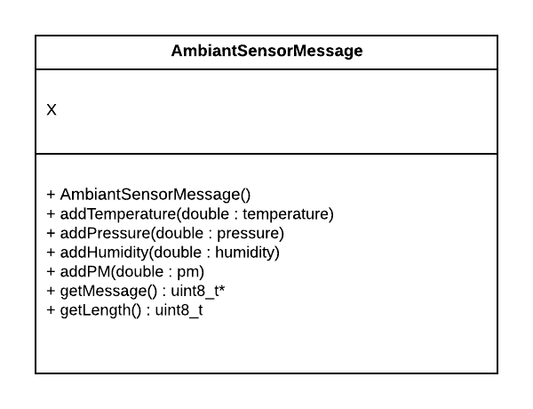

# Mbed LoRaWAN Ambiant Sensor Message

This is a libray that makes use of the [LoRaMessage class](https://github.com/sillevl/mbed-lorawan-serialization) to be able to send messages to the LoRaWAN network with valid temperature, humidity, pressure and pm (particle measure) data.

After setting up your message, to send it over the LoRaWAN network you can make use of the [SimpleLoraWAN Library](https://github.com/sillevl/mbed-Simple-LoRaWAN).
For more information on the settings, pinouts, and more, you can take a look at the [LoraWAN Shield Example](https://github.com/sillevl/lorawan-shield-example).

## Getting started
To add this library to your mbed project, use the following commands with the mbed-cli in your projects directory:
```
mbed add <https link to this repo>
mbed deploy
```
The first line adds the library to your project, the second downloads the actual files so you can start using the AmbiantSensorMessage class.

Remember that you will also need the SimpleLoRaWAN library to actually send your data.

## Example
```c++
#include "Simple-LoRaWAN.h"
#include "AmbiantSensorMessage.h"
#include "settings.h"

int main(void)
{
    double temperature = 22.64;  // value in °C
    double humidity = 9.55;      // value in %
    double pressure = 1013.5;    // value in hPa
    double pm25 = 12.3;          // value in µg/m³
    double pm10 = 23.4;          // value in µg/m³

    while(true) {
        SimpleLoRaWAN::Node node(keys, pins);
        ParticulaLora::AmbiantSensorMessage message;

        message.addTemperature(temperature);
        message.addHumidity(humidity);
        message.addPressure(pressure);
        message.addPM(pm25);
        message.addPM(pm10);

        node.send(message.getMessage(), message.getLength());
        wait(30.0);
    }

    return 0;
}

```
An AmbiantSensorMessage takes arguments of the integer type, with the payload decoder on [The Things Network console](https://console.thethingsnetwork.org/) you can adjust the precision.

## Example TTN Payload Decoder

```javascript
function intToDouble(value, places) {
  // converts int to a double with n decimal places
  position = 1
  for (i = 0; i < places; i++) {
    position *= 10
  }
  return (1.00 * value) / position
}

function Decoder(bytes, port) {
  // Decode an uplink message from a buffer
  // (array) of bytes to an object of fields.
  var decoded = {};

  if (port === 1) {
    decoded.temperature = intToDouble(bytes[0] + bytes[1] * 256, 2)
    decoded.humidity = intToDouble(bytes[2] + bytes[3] * 256, 2)
    decoded.pressure = intToDouble(bytes[4] + bytes[5] * 256, 1)
    decoded.pm25 = intToDouble(bytes[6] + bytes[7] * 256, 1)
    decoded.pm10 = intToDouble(bytes[8] + bytes[9] * 256, 1)
  }
  return decoded;
}
```


## UML Diagrams

